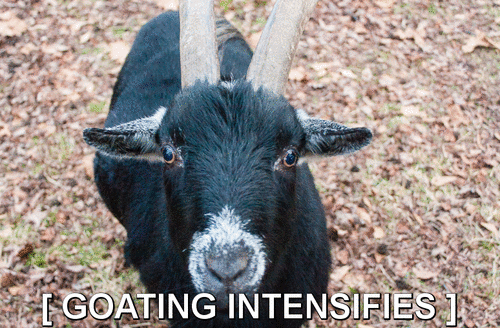

# Intensifying Intensifier

## Description

A script that takes any image and makes a shaking GIF out of it, optionally with subtitles.

## Requirements

The script runs on [**Python 3**](http://www.python.org/getit/) (tested on 3.4) and requires [**ImageMagick**](http://www.imagemagick.org/script/index.php). It's also written for Windows, but could be quickly adapted to another OS.

## Usage

I used ImageMagick binaries instead of the libraries, and also did not add detection for the binary location, so the path is currently hardcoded into **intensifier.py**.

Once this variable is set, you can either run the script with **python intensifier.py imagefile [-doSubtitle]** or drag an image onto **intensifier.bat** for no subtitle, or **with subtitles.bat** to be prompted for a subtitle.

## Current Issues

  * ImageMagick binaries are used instead of libraries
  * ImageMagick path is hardcoded
  * temporary frames aren't deleted after GIF is created

## Version History

### 2014-04-26 - v2.1

  * fixed a breaking bug

### 2014-04-19 - v2

  * added subtitle support

### 2014-04-18 - v1

  * initial version
